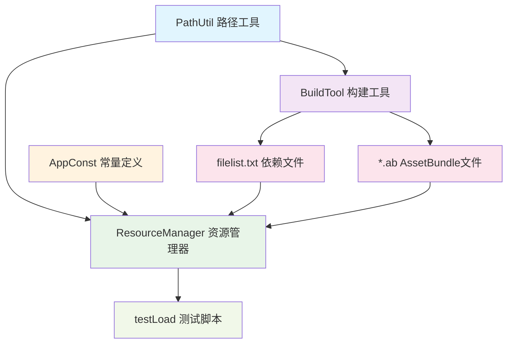
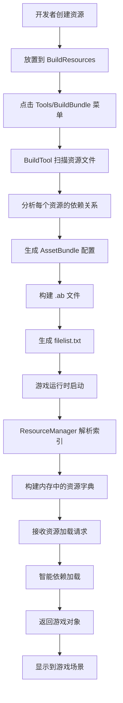

# XLua AssetBundle 框架 - 整体架构设计文档

## 📋 项目概述

### 项目名称
**XLua AssetBundle 自动化管理框架**

### 设计目标
- 🎯 **自动化依赖管理**: 自动分析和处理资源间的依赖关系
- 🔄 **统一工作流程**: 从打包到加载的一体化解决方案  
- 🚀 **开发效率提升**: 简化AssetBundle的使用复杂度
- 🛠️ **易维护性**: 模块化设计，职责分离明确

## 🏗️ 系统架构

### 分层架构设计
```
┌─────────────────────────────────────┐
│          测试验证层                  │  testLoad.cs
├─────────────────────────────────────┤
│          业务接口层                  │  ResourceManager.cs
├─────────────────────────────────────┤
│          工具支撑层                  │  PathUtil.cs, AppConst.cs
├─────────────────────────────────────┤
│          构建工具层                  │  BuildTool.cs
├─────────────────────────────────────┤
│          数据存储层                  │  filelist.txt, *.ab files
└─────────────────────────────────────┘
```

### 核心组件关系图


## 📊 详细组件设计

### 组件功能对照表

| 组件名称 | 类型 | 主要职责 | 核心方法 | 设计意图 |
|----------|------|----------|----------|----------|
| **BuildTool.cs** | 编辑器工具 | AssetBundle自动化打包 | `Build()`, `GetDependence()` | 📦 构建阶段的核心引擎 |
| **PathUtil.cs** | 工具类 | 路径处理和标准化 | `GetUnityPath()`, `GetStardardPath()` | 🛠️ 统一路径处理标准 |
| **ResourceManager.cs** | 运行时管理器 | 智能资源加载管理 | `ParseVersionFile()`, `LoadBundleAsync()` | 🎮 运行时加载大脑 |
| **AppConst.cs** | 常量定义 | 项目配置常量 | 常量定义 | ⚙️ 集中配置管理 |
| **testLoad.cs** | 测试脚本 | 功能验证测试 | `Start()` | 🧪 功能验证工具 |
| **filelist.txt** | 数据文件 | 依赖关系存储 | 数据格式 | 📄 依赖关系数据库 |

### BuildTool.cs - 构建工具层
**设计职责**: AssetBundle自动化打包和依赖分析

**核心工作流程**:
1. **文件扫描**: 遍历`Assets/BuildResources`目录下所有资源
2. **依赖分析**: 使用`AssetDatabase.GetDependencies()`分析每个资源的依赖
3. **路径处理**: 通过PathUtil统一处理路径格式
4. **配置生成**: 创建AssetBundleBuild配置对象
5. **文件构建**: 调用Unity的BuildPipeline生成.ab文件
6. **索引记录**: 生成filelist.txt记录所有依赖关系

**关键设计特点**:
- ✅ 自动排除C#脚本文件（已编译到程序中）
- ✅ 支持递归依赖分析
- ✅ 跨平台路径处理

### ResourceManager.cs - 运行时管理层
**设计职责**: 智能资源加载和依赖管理

**核心数据结构**:
```csharp
internal class BundleInfo
{
    public string AssetsName;    // 原始资源路径
    public string BundleName;    // AssetBundle文件名
    public List<string> Dependences; // 依赖资源列表
}
```

**加载工作流程**:
1. **索引构建**: 启动时解析filelist.txt构建内存索引
2. **依赖检查**: 接收加载请求时检查依赖关系
3. **递归加载**: 按依赖顺序递归加载所有相关AssetBundle
4. **资源提取**: 从正确的AssetBundle中提取目标资源
5. **回调通知**: 通过委托回调返回加载结果

### PathUtil.cs - 工具支撑层
**设计职责**: 统一路径处理和格式标准化

**核心方法说明**:
- `GetUnityPath()`: 将完整路径转换为Unity识别的相对路径
- `GetStardardPath()`: 统一路径分隔符为正斜杠（跨平台兼容）
- 路径常量定义: 统一管理各种路径配置

## 🔄 完整工作流程

### 开发到运行的完整流程图


### 数据流转关系


## 📈 数据处理流程

### 数据转换管线
| 阶段 | 输入数据 | 处理过程 | 输出数据 | 作用说明 |
|------|----------|----------|----------|----------|
| **文件发现** | `Assets/BuildResources/*` | `Directory.GetFiles()` | 文件路径数组 | 🔍 发现所有待打包资源 |
| **路径标准化** | 完整文件路径 | `PathUtil.GetUnityPath()` | Unity相对路径 | 🛤️ 统一路径格式 |
| **依赖分析** | Unity资源路径 | `AssetDatabase.GetDependencies()` | 依赖路径列表 | 🔗 建立资源关联图 |
| **信息打包** | 路径+Bundle名+依赖 | 字符串拼接组合 | bundleInfo字符串 | 📝 创建资源描述 |
| **文件构建** | AssetBundleBuild配置 | `BuildPipeline.BuildAssetBundles()` | .ab二进制文件 | 🏗️ 生成最终资源包 |
| **索引解析** | filelist.txt内容 | `Split('|')` 字符串分割 | BundleInfo对象 | 🗂️ 构建运行时索引 |
| **资源实例化** | 资源加载请求 | 异步加载流程 | GameObject实例 | 🎮 交付游戏使用 |

## ⚡ 技术特点与优势

### 系统特点
- **🤖 高度自动化**: 依赖关系自动分析，无需手工维护
- **🔧 模块化设计**: 各组件职责单一，耦合度低
- **🌍 跨平台支持**: 考虑不同平台的路径差异
- **📊 性能优化**: 按需加载，避免内存浪费
- **🔍 易于调试**: 生成可读的依赖信息文件

### 架构优势
1. **开发友好**: 开发者只需关注资源创建，无需关心复杂的依赖管理
2. **维护简单**: 依赖关系自动维护，减少人工错误
3. **扩展灵活**: 组件化设计便于添加新功能
4. **性能可控**: 提供细粒度的资源加载控制

## 🔧 当前项目状态

### 已实现功能 ✅
- [x] 自动文件扫描和路径处理
- [x] 智能依赖关系分析  
- [x] AssetBundle自动构建
- [x] 依赖信息文件生成
- [x] 基础的运行时加载框架
- [x] 测试验证脚本

### 待解决问题 ❌
- [ ] **数据格式bug**: filelist.txt解析时数组越界
- [ ] **错误处理缺失**: 缺少文件不存在等异常处理
- [ ] **测试不完整**: testLoad未使用新的ResourceManager系统
- [ ] **文档缺乏**: 缺少使用说明和API文档

### 优化建议 💡
1. **修复数据格式**: 在资源路径和Bundle名称间添加明确分隔符
2. **完善错误处理**: 添加异常捕获和用户友好的错误提示
3. **集成测试**: 让testLoad使用ResourceManager而非硬编码加载
4. **性能优化**: 添加资源缓存和内存管理机制

## 📖 使用指南

### 开发流程
1. **资源准备**: 将需要打包的资源放到`Assets/BuildResources`文件夹
2. **执行打包**: 在Unity编辑器中选择菜单`Tools/BuildBundle/Build Windows Bundle`
3. **验证结果**: 检查`Assets/StreamingAssets`文件夹中生成的.ab文件和filelist.txt
4. **运行测试**: 启动游戏，ResourceManager会自动处理资源加载

### API使用示例
```csharp
// 推荐的资源加载方式
ResourceManager.Instance.LoadAsset(
    "Assets/BuildResources/UI/Prefabs/MainUI.prefab", 
    (obj) => {
        GameObject ui = Instantiate(obj) as GameObject;
        // 处理加载完成的UI对象
    }
);
```

## 🎯 设计理念总结

这个AssetBundle框架体现了以下软件设计理念：

- **单一职责原则**: 每个组件都有明确的职责边界
- **开闭原则**: 对扩展开放，对修改封闭
- **依赖倒置**: 高层模块不依赖低层模块，都依赖于抽象
- **自动化优先**: 能自动化的绝不手工操作
- **用户体验**: 简化开发者的使用复杂度

通过这样的设计，实现了一个**完整、自动化、易维护**的AssetBundle管理系统，为Unity项目的资源管理提供了强有力的技术支撑。

---
*文档版本: v1.0*  
*更新日期: 2025-09-27*  
*适用项目: XLua AssetBundle Framework*