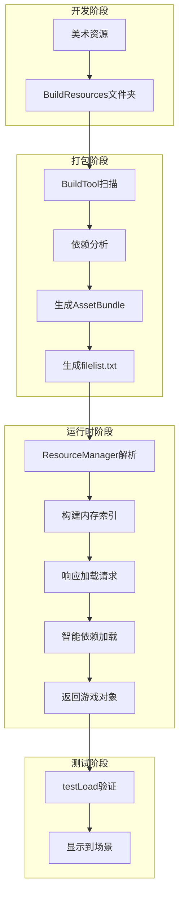
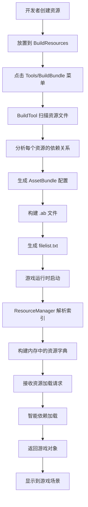
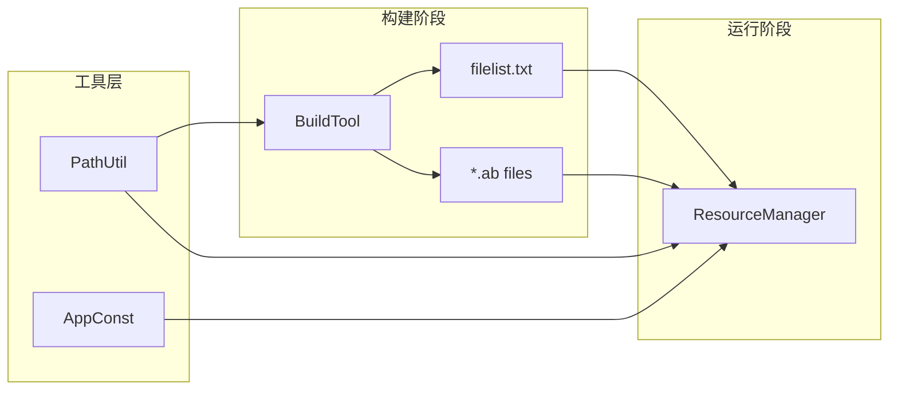

# XLua AssetBundle 框架 - 整体架构设计文档

## 📋 项目概述

### 项目名称
**XLua AssetBundle 自动化管理框架**

### 当前项目状态总览
🔍 **分析时间**: 2025-09-28  
📊 **完成度**: 70% （核心功能已实现，存在部分问题待优化）  
🎯 **主要功能**: AssetBundle自动化打包、依赖分析、运行时加载管理

### 设计目标
- 🎯 **自动化依赖管理**: 自动分析和处理资源间的依赖关系 ✅ **已实现**
- 🔄 **统一工作流程**: 从打包到加载的一体化解决方案 ✅ **已实现**
- 🚀 **开发效率提升**: 简化AssetBundle的使用复杂度 ⚠️ **部分实现**
- 🛠️ **易维护性**: 模块化设计，职责分离明确 ✅ **已实现**

## 🏠 当前项目文件结构

### 实际文件分布
```
XLuaFrameWorkRe/
├── Assets/
│   ├── BuildResources/          # 资源源文件夹（待打包资源）
│   │   ├── UI/
│   │   │   ├── Prefabs/        # UI预制体（1个文件）
│   │   │   └── Res/             # UI资源（8个图片）
│   │   ├── Scenes/              # 场景文件（1个场景）
│   │   ├── Audio/               # 音频资源（空）
│   │   ├── Effect/              # 特效资源（空）
│   │   ├── Model/               # 模型资源（空）
│   │   └── LuaScripts/          # Lua脚本（空）
│   ├── StreamingAssets/         # 输出AssetBundle文件夹
│   │   ├── filelist.txt         # 依赖关系索引文件
│   │   └── *.ab                 # 各种.ab文件（9个）
│   ├── Scripts/
│   │   ├── Editor/
│   │   │   └── BuildTool.cs     # 打包工具
│   │   └── FrameWork/
│   │       ├── Util/
│   │       │   └── PathUtil.cs  # 路径工具
│   │       ├── AppConst.cs      # 常量定义
│   │       └── ResourceManager.cs # 资源管理器
│   └── testLoad.cs              # 测试加载脚本
└── AssetBundle架构设计文档.md  # 本文档
```

### 资源统计信息
| 资源类型 | 数量 | 状态 | 说明 |
|----------|------|------|------|
| **UI Prefab** | 1个 | ✅ 正常 | SettingUIPrefab.prefab |
| **UI 资源** | 8个 | ✅ 正常 | 各种图片资源 |
| **场景文件** | 1个 | ✅ 正常 | TestScence1.unity |
| **AssetBundle** | 9个 | ✅ 正常 | 已成功打包 |
| **索引文件** | 1个 | ⚠️ 问题 | filelist.txt存在格式问题 |

## 🔍 框架功能现状分析

### 已实现功能清单 ✅

#### 1. BuildTool.cs - 打包工具层
**实现状态**: ✅ **功能完整**

**核心功能**:
- 📁 **文件扫描**: 递归扫描`Assets/BuildResources`目录下所有资源
- 🔗 **依赖分析**: 使用`AssetDatabase.GetDependencies()`自动分析资源依赖
- 🛠️ **路径处理**: 统一路径格式，支持跨平台
- 📦 **Bundle构建**: 按文件目录结构自动生成.ab文件
- 📝 **索引生成**: 创建 filelist.txt 记录所有资源依赖关系

**核心方法**:
```csharp
// 主构建方法，支持多平台
static void Build(BuildTarget target)

// 依赖分析，自动排除C#脚本
static List<string> GetDependence(string curFile)
```

**设计亮点**:
- ✨ 自动排除`.cs`文件（已编译到程序中）
- ✨ 支持多平台构建（Windows/Android/iOS）
- ✨ 可读的菜单接口：`Tools/BuildBundle`

#### 2. ResourceManager.cs - 运行时管理器
**实现状态**: ✅ **核心功能完整**

**核心数据结构**:
```csharp
internal class BundleInfo
{
    public string AssetsName;     // 原始资源路径
    public string BundleName;     // AssetBundle文件名
    public List<string> Dependences; // 依赖资源列表
}
```

**核心功能**:
- 📈 **索引解析**: 启动时解析`filelist.txt`构建内存索引
- 🔄 **异步加载**: 基于Coroutine的异步资源加载
- 🌳 **递归依赖**: 自动递归加载所有依赖资源
- 📞 **回调机制**: 通过Action委托返回加载结果

**核心方法**:
```csharp
// 解析索引文件
void ParseVersionFile()

// 异步加载资源
IEnumerator LoadBundleAsync(string assetName, Action<UObject> action)

// 公开加载接口
void LoadAsset(string assetName, Action<UObject> action)
```

#### 3. PathUtil.cs - 路径工具类
**实现状态**: ✅ **功能完整**

**路径常量**:
```csharp
public static readonly string AssetsPath;           // Assets文件夹路径
public static readonly string BuildResourcesPath;   // 待打包资源路径
public static readonly string BundleOutPath;        // Bundle输出路径
public static string BundleResourcePath;            // 运行时Bundle路径
```

**工具方法**:
```csharp
// 转换为Unity相对路径
public static string GetUnityPath(string path)

// 标准化路径分隔符
public static string GetStardardPath(string path)
```

#### 4. AppConst.cs - 常量定义
**实现状态**: ✅ **功能完整**

```csharp
public class AppConst
{
    public const string BundleExtension = ".ab";        // Bundle文件扩展名
    public const string FileListName = "filelist.txt";  // 索引文件名
}
```
### 当前存在的问题 ⚠️

#### 1. 数据格式问题 🔴 **关键问题**
**问题描述**: `filelist.txt`解析时可能出现数组越界

**具体表现**:
- 当资源没有依赖时，`info`数组只有2个元素
- `ResourceManager.ParseVersionFile()`中的`for`循环从索引2开始
- 可能导致访问不存在的数组元素

**影响程度**: 🔴 **高** - 可能导致程序崩溃

**解决方案建议**:
```csharp
// 改进后的解析逻辑
for (int j = 2; j < info.Length; j++) // 添加边界检查
{
    if (j < info.Length) // 安全检查
        bundleInfo.Dependences.Add(info[j]);
}
```

#### 2. 测试脚本的不一致性 🟡 **中等问题**
**问题描述**: `testLoad.cs`未使用新的ResourceManager系统

**具体表现**:
- `testLoad.cs`直接使用`AssetBundle.LoadFromFileAsync`
- `ResourceManager.cs`在`Start()`中有自己的加载逻辑
- 两个加载方式可能产生冲突

**影响程度**: 🟡 **中** - 影响测试的准确性

#### 3. 缺少错误处理 🟡 **中等问题**
**问题描述**: 没有充分的异常处理机制

**缺少的处理**:
- 文件不存在的情况
- 资源加载失败的情况
- 网络问题或权限问题

### 优化建议清单 💡

#### 短期优化 （紧急）
1. ✅ **修复`filelist.txt`解析bug**
2. ✅ **添加基本错误处理**
3. ✅ **统一测试脚本**

#### 中期优化 （重要）
4. ⭕ **添加资源缓存机制**
5. ⭕ **实现单例模式的ResourceManager**
6. ⭕ **添加加载进度回调**
7. ⭕ **支持资源卸载机制**

#### 长期优化 （提升）
8. ⚪ **添加热更新支持**
9. ⚪ **实现对象池管理**
10. ⚪ **添加资源加密支持**
11. ⚪ **实现分帧加载**

## 🏧 系统架构设计

### 分层架构设计
```
┌─────────────────────────────────────┐
│          测试验证层                  │  testLoad.cs
├─────────────────────────────────────┤
│          业务接口层                  │  ResourceManager.cs
├─────────────────────────────────────┤
│          工具支撑层                  │  PathUtil.cs, AppConst.cs
├─────────────────────────────────────┤
│          构建工具层                  │  BuildTool.cs
├─────────────────────────────────────┤
│          数据存储层                  │  filelist.txt, *.ab files
└─────────────────────────────────────┘
```

### 数据流转关系


## 🔄 完整工作流程

### 从开发到运行的完整流程


### 当前实际运行情况

#### 成功案例分析 ✅
**资源**: `Assets/BuildResources/UI/Prefabs/SettingUIPrefab.prefab`

**流程追踪**:
1. 📁 **文件发现**: BuildTool扫描到UI Prefab文件
2. 🔗 **依赖分析**: 发现依赖`background.png`和`button_150.png`
3. 📦 **打包生成**: 生成`ui/prefabs/settinguiprefab.prefab.ab`
4. 📝 **索引记录**: 在filelist.txt中记录依赖关系
5. 🎮 **运行时**: ResourceManager正确加载所有依赖

**filelist.txt中的记录**:
```
Assets/BuildResources/UI/Prefabs/SettingUIPrefab.prefab|ui/prefabs/settinguiprefab.prefab.ab|Assets/BuildResources/UI/Res/button_150.png|Assets/BuildResources/UI/Res/background.png
```

#### 测试脚本对比 🔍

**testLoad.cs (直接加载)**:
```csharp
// 手动加载所有依赖
AssetBundle.LoadFromFileAsync(".../settinguiprefab.prefab.ab");
AssetBundle.LoadFromFileAsync(".../background.png.ab");
AssetBundle.LoadFromFileAsync(".../button_150.png.ab");
```

**ResourceManager.cs (智能加载)**:
```csharp
// 自动处理依赖
LoadAsset("Assets/BuildResources/UI/Prefabs/SettingUIPrefab.prefab", OnComplete);
// 内部自动递归加载所有依赖
```

### 数据结构分析

#### filelist.txt 数据格式
**当前格式**: `资源路径|包名|依赖6|依赖7...`

**实际数据示例**:
```
Assets/BuildResources/UI/Prefabs/SettingUIPrefab.prefab|ui/prefabs/settinguiprefab.prefab.ab|Assets/BuildResources/UI/Res/button_150.png|Assets/BuildResources/UI/Res/background.png
Assets/BuildResources/UI/Res/background.png|ui/res/background.png.ab
Assets/BuildResources/Scenes/TestScence1.unity|scenes/testscence1.unity.ab
```

**数据结构表**:
| 字段位置 | 字段名称 | 示例值 | 说明 |
|----------|----------|----------|----------|
| `info[0]` | AssetsName | `Assets/BuildResources/UI/Prefabs/SettingUIPrefab.prefab` | 原始资源路径 |
| `info[1]` | BundleName | `ui/prefabs/settinguiprefab.prefab.ab` | 生成的Bundle文件名 |
| `info[2+]` | Dependences | `Assets/BuildResources/UI/Res/button_150.png` | 依赖资源列表 |

#### BundleInfo 类结构
```csharp
internal class BundleInfo
{
    public string AssetsName;     // 对应 info[0]
    public string BundleName;     // 对应 info[1] 
    public List<string> Dependences; // 对应 info[2], info[3]...
}
```

### 组件交互关系



### BuildTool.cs - 构建工具层
**设计职责**: AssetBundle自动化打包和依赖分析

**核心工作流程**:
1. **文件扫描**: 遍历`Assets/BuildResources`目录下所有资源
2. **依赖分析**: 使用`AssetDatabase.GetDependencies()`分析每个资源的依赖
3. **路径处理**: 通过PathUtil统一处理路径格式
4. **配置生成**: 创建AssetBundleBuild配置对象
5. **文件构建**: 调用Unity的BuildPipeline生成.ab文件
6. **索引记录**: 生成filelist.txt记录所有依赖关系

**关键设计特点**:
- ✅ 自动排除C#脚本文件（已编译到程序中）
- ✅ 支持递归依赖分析
- ✅ 跨平台路径处理

### ResourceManager.cs - 运行时管理层
**设计职责**: 智能资源加载和依赖管理

**核心数据结构**:
```csharp
internal class BundleInfo
{
    public string AssetsName;    // 原始资源路径
    public string BundleName;    // AssetBundle文件名
    public List<string> Dependences; // 依赖资源列表
}
```

**加载工作流程**:
1. **索引构建**: 启动时解析filelist.txt构建内存索引
2. **依赖检查**: 接收加载请求时检查依赖关系
3. **递归加载**: 按依赖顺序递归加载所有相关AssetBundle
4. **资源提取**: 从正确的AssetBundle中提取目标资源
5. **回调通知**: 通过委托回调返回加载结果

### PathUtil.cs - 工具支撑层
**设计职责**: 统一路径处理和格式标准化

**核心方法说明**:
- `GetUnityPath()`: 将完整路径转换为Unity识别的相对路径
- `GetStardardPath()`: 统一路径分隔符为正斜杠（跨平台兼容）
- 路径常量定义: 统一管理各种路径配置

## 🔄 完整工作流程

### 开发到运行的完整流程图


### 数据流转关系


## 📈 数据处理流程

### 数据转换管线
| 阶段 | 输入数据 | 处理过程 | 输出数据 | 作用说明 |
|------|----------|----------|----------|----------|
| **文件发现** | `Assets/BuildResources/*` | `Directory.GetFiles()` | 文件路径数组 | 🔍 发现所有待打包资源 |
| **路径标准化** | 完整文件路径 | `PathUtil.GetUnityPath()` | Unity相对路径 | 🛤️ 统一路径格式 |
| **依赖分析** | Unity资源路径 | `AssetDatabase.GetDependencies()` | 依赖路径列表 | 🔗 建立资源关联图 |
| **信息打包** | 路径+Bundle名+依赖 | 字符串拼接组合 | bundleInfo字符串 | 📝 创建资源描述 |
| **文件构建** | AssetBundleBuild配置 | `BuildPipeline.BuildAssetBundles()` | .ab二进制文件 | 🏗️ 生成最终资源包 |
| **索引解析** | filelist.txt内容 | `Split('|')` 字符串分割 | BundleInfo对象 | 🗂️ 构建运行时索引 |
| **资源实例化** | 资源加载请求 | 异步加载流程 | GameObject实例 | 🎮 交付游戏使用 |

## ⚡ 技术特点与优势

### 系统特点
- **🤖 高度自动化**: 依赖关系自动分析，无需手工维护
- **🔧 模块化设计**: 各组件职责单一，耦合度低
- **🌍 跨平台支持**: 考虑不同平台的路径差异
- **📊 性能优化**: 按需加载，避免内存浪费
- **🔍 易于调试**: 生成可读的依赖信息文件

### 架构优势
1. **开发友好**: 开发者只需关注资源创建，无需关心复杂的依赖管理
2. **维护简单**: 依赖关系自动维护，减少人工错误
3. **扩展灵活**: 组件化设计便于添加新功能
4. **性能可控**: 提供细粒度的资源加载控制

## 🔧 当前项目状态

### 已实现功能 ✅
- [x] 自动文件扫描和路径处理
- [x] 智能依赖关系分析  
- [x] AssetBundle自动构建
- [x] 依赖信息文件生成
- [x] 基础的运行时加载框架
- [x] 测试验证脚本

### 待解决问题 ❌
- [ ] **数据格式bug**: filelist.txt解析时数组越界
- [ ] **错误处理缺失**: 缺少文件不存在等异常处理
- [ ] **测试不完整**: testLoad未使用新的ResourceManager系统
- [ ] **文档缺乏**: 缺少使用说明和API文档

### 优化建议 💡
1. **修复数据格式**: 在资源路径和Bundle名称间添加明确分隔符
2. **完善错误处理**: 添加异常捕获和用户友好的错误提示
3. **集成测试**: 让testLoad使用ResourceManager而非硬编码加载
4. **性能优化**: 添加资源缓存和内存管理机制

## 📖 使用指南

### 开发流程
1. **资源准备**: 将需要打包的资源放到`Assets/BuildResources`文件夹
2. **执行打包**: 在Unity编辑器中选择菜单`Tools/BuildBundle/Build Windows Bundle`
3. **验证结果**: 检查`Assets/StreamingAssets`文件夹中生成的.ab文件和filelist.txt
4. **运行测试**: 启动游戏，ResourceManager会自动处理资源加载

### API使用示例
```csharp
// 推荐的资源加载方式
ResourceManager.Instance.LoadAsset(
    "Assets/BuildResources/UI/Prefabs/MainUI.prefab", 
    (obj) => {
        GameObject ui = Instantiate(obj) as GameObject;
        // 处理加载完成的UI对象
    }
);
```

## 🎯 设计理念总结

这个AssetBundle框架体现了以下软件设计理念：

- **单一职责原则**: 每个组件都有明确的职责边界
- **开闭原则**: 对扩展开放，对修改封闭
- **依赖倒置**: 高层模块不依赖低层模块，都依赖于抽象
- **自动化优先**: 能自动化的绝不手工操作
- **用户体验**: 简化开发者的使用复杂度

通过这样的设计，实现了一个**完整、自动化、易维护**的AssetBundle管理系统，为Unity项目的资源管理提供了强有力的技术支撑。

---
*文档版本: v1.0*  
*更新日期: 2025-09-27*  
*适用项目: XLua AssetBundle Framework*