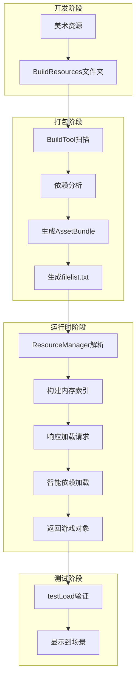
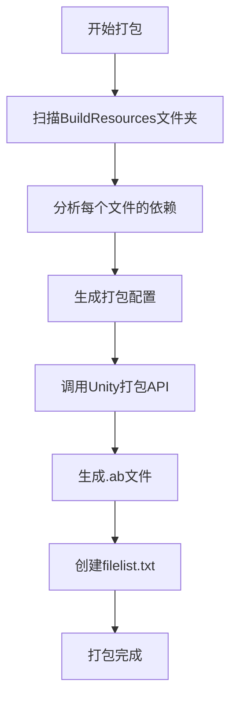
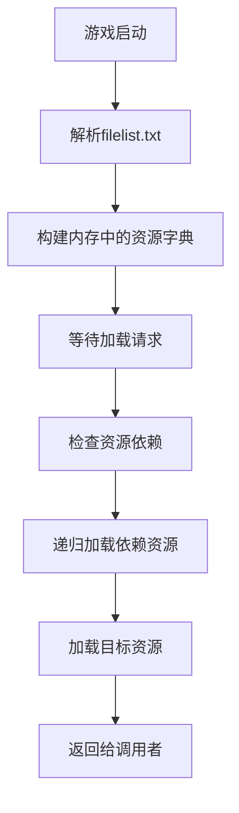
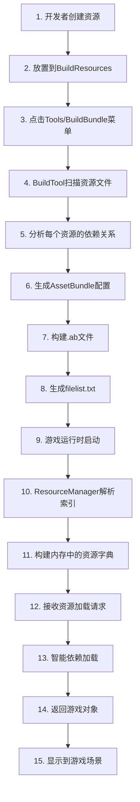

# XLua AssetBundle框架 - 完整分析文档

## 📋 文档概述

**文档版本**: v2.0  
**分析日期**: 2025-09-28  
**适用项目**: XLuaFrameWorkRe  
**文档性质**: 框架现状分析与设计说明

## 🎯 框架简介

### 什么是AssetBundle？
AssetBundle是Unity提供的一种**资源打包技术**，可以把游戏资源（如图片、音频、模型等）单独打包成文件，在游戏运行时按需加载。

**通俗理解**：
- 🎒 把游戏资源装进"背包"（AssetBundle文件）
- 🚚 游戏运行时从"背包"里取出需要的东西
- 💾 节省内存，提高游戏性能

### 本框架的目标
这个框架的核心目标是让AssetBundle的使用变得**傻瓜式操作**：
- ✅ 开发者只需把资源放到指定文件夹
- ✅ 点击菜单就能自动打包
- ✅ 代码中一行调用就能加载资源

## 🏠 项目文件结构分析

### 当前项目结构
```
XLuaFrameWorkRe/
├── Assets/
│   ├── BuildResources/          # 📁 资源源文件夹（待打包资源）
│   │   ├── UI/
│   │   │   ├── Prefabs/        # 🎨 UI预制体（1个文件）
│   │   │   └── Res/            # 🖼️ UI资源（8个图片）
│   │   ├── Scenes/             # 🎬 场景文件（1个场景）
│   │   ├── Audio/              # 🎵 音频资源（空）
│   │   ├── Effect/             # ✨ 特效资源（空）
│   │   ├── Model/              # 🎭 模型资源（空）
│   │   └── LuaScripts/         # 📜 Lua脚本（空）
│   ├── StreamingAssets/        # 📦 输出AssetBundle文件夹
│   │   ├── filelist.txt        # 📋 依赖关系索引文件
│   │   └── *.ab               # 📦 各种.ab文件（9个）
│   ├── Scripts/
│   │   ├── Editor/
│   │   │   └── BuildTool.cs    # 🔨 打包工具
│   │   └── FrameWork/
│   │       ├── Util/
│   │       │   └── PathUtil.cs # 🛣️ 路径工具
│   │       ├── AppConst.cs     # ⚙️ 常量定义
│   │       └── ResourceManager.cs # 🎮 资源管理器
│   └── testLoad.cs             # 🧪 测试加载脚本
└── AssetBundle框架完整分析文档.md  # 📖 本文档
```

### 资源统计信息
| 资源类型 | 数量 | 状态 | 说明 |
|----------|------|------|------|
| **UI Prefab** | 1个 | ✅ 正常 | SettingUIPrefab.prefab |
| **UI 资源** | 8个 | ✅ 正常 | 各种图片资源 |
| **场景文件** | 1个 | ✅ 正常 | TestScence1.unity |
| **AssetBundle** | 9个 | ✅ 正常 | 已成功打包 |
| **索引文件** | 1个 | ⚠️ 问题 | filelist.txt存在格式问题 |

## 🏗️ 框架架构设计

### 分层架构图
```
┌─────────────────────────────────────┐
│          测试验证层                  │  testLoad.cs
├─────────────────────────────────────┤
│          业务接口层                  │  ResourceManager.cs
├─────────────────────────────────────┤
│          工具支撑层                  │  PathUtil.cs, AppConst.cs
├─────────────────────────────────────┤
│          构建工具层                  │  BuildTool.cs
├─────────────────────────────────────┤
│          数据存储层                  │  filelist.txt, *.ab files
└─────────────────────────────────────┘
```

### 组件关系图


## 🔍 核心组件详细分析

### 1. BuildTool.cs - 打包工具 🔨

**简单理解**：这是一个"打包机器人"，能自动把资源打包成AssetBundle文件。

#### 核心功能
| 功能 | 说明 | 状态 |
|------|------|------|
| **文件扫描** | 自动找到所有需要打包的资源 | ✅ 已实现 |
| **依赖分析** | 自动分析资源之间的依赖关系 | ✅ 已实现 |
| **路径处理** | 统一处理文件路径格式 | ✅ 已实现 |
| **打包构建** | 生成最终的.ab文件 | ✅ 已实现 |
| **索引生成** | 创建依赖关系记录文件 | ✅ 已实现 |

#### 工作流程图


#### 使用方法
1. 在Unity编辑器中找到菜单：`Tools/BuildBundle`
2. 选择目标平台：
   - `Build Windows Bundle` - PC平台
   - `Build Android Bundle` - 安卓平台
   - `Build iOS Bundle` - iOS平台
3. 等待打包完成

### 2. ResourceManager.cs - 资源管理器 🎮

**简单理解**：这是一个"智能管家"，负责在游戏运行时加载资源。

#### 核心数据结构
```csharp
// 每个资源的信息记录
internal class BundleInfo
{
    public string AssetsName;     // 资源的原始路径
    public string BundleName;     // 打包后的文件名
    public List<string> Dependences; // 这个资源依赖哪些其他资源
}
```

#### 工作流程


#### 主要方法说明
| 方法名 | 作用 | 调用时机 |
|--------|------|----------|
| `ParseVersionFile()` | 解析依赖关系文件 | 游戏启动时 |
| `LoadBundleAsync()` | 异步加载资源 | 需要资源时 |
| `LoadAsset()` | 公开的加载接口 | 业务代码调用 |

### 3. PathUtil.cs - 路径工具 🛣️

**简单理解**：这是一个"导航仪"，负责处理各种文件路径。

#### 关键路径常量
```csharp
// 项目关键路径定义
AssetsPath = "E:/unityXiangmu/XLuaFrameWorkRe/Assets"
BuildResourcesPath = AssetsPath + "/BuildResources"     // 待打包资源路径
BundleOutPath = Application.streamingAssetsPath         // 输出路径
BundleResourcePath = Application.streamingAssetsPath    // 运行时读取路径
```

#### 工具方法
| 方法名 | 功能 | 示例 |
|--------|------|------|
| `GetUnityPath()` | 转换为Unity认识的相对路径 | `Assets/BuildResources/UI/...` |
| `GetStardardPath()` | 统一路径分隔符 | 把`\`变成`/` |

### 4. AppConst.cs - 常量定义 ⚙️

**简单理解**：这是一个"配置中心"，存放项目的各种配置常量。

```csharp
public class AppConst
{
    public const string BundleExtension = ".ab";        // 文件扩展名
    public const string FileListName = "filelist.txt"; // 索引文件名
}
```

## 📊 数据流转分析

### filelist.txt 数据格式详解

**文件作用**：记录每个资源的依赖关系，相当于一个"电话簿"。

#### 数据格式
```
资源路径|包名|依赖1|依赖2|...
```

#### 实际数据示例
```
Assets/BuildResources/UI/Prefabs/SettingUIPrefab.prefab|ui/prefabs/settinguiprefab.prefab.ab|Assets/BuildResources/UI/Res/button_150.png|Assets/BuildResources/UI/Res/background.png
Assets/BuildResources/UI/Res/background.png|ui/res/background.png.ab
Assets/BuildResources/Scenes/TestScence1.unity|scenes/testscence1.unity.ab
```

#### 数据解析表
| 字段位置 | 字段名称 | 示例值 | 说明 |
|----------|----------|----------|----------|
| `info[0]` | AssetsName | `Assets/BuildResources/UI/Prefabs/SettingUIPrefab.prefab` | 原始资源路径 |
| `info[1]` | BundleName | `ui/prefabs/settinguiprefab.prefab.ab` | 生成的Bundle文件名 |
| `info[2+]` | Dependences | `Assets/BuildResources/UI/Res/button_150.png` | 依赖资源列表 |

## 🔄 完整工作流程

### 从开发到运行的完整过程


### 成功案例分析 ✅

**以SettingUIPrefab为例**：

1. **资源准备**：开发者创建了一个UI预制体，使用了两张图片
2. **自动发现**：BuildTool扫描到这个预制体
3. **依赖分析**：自动发现它依赖`background.png`和`button_150.png`
4. **打包生成**：
   - 生成`ui/prefabs/settinguiprefab.prefab.ab`
   - 生成`ui/res/background.png.ab`
   - 生成`ui/res/button_150.png.ab`
5. **索引记录**：在filelist.txt中记录依赖关系
6. **运行时加载**：ResourceManager自动按顺序加载所有依赖

## ⚠️ 当前存在的问题

### 1. 数据格式问题 🚨 **紧急**

**问题描述**：filelist.txt解析时可能出现数组越界

**具体原因**：
- 当资源没有依赖时，分割后的数组只有2个元素
- 但代码中的循环从索引2开始，可能访问不存在的元素

**影响程度**：🔴 **高** - 可能导致程序崩溃

**解决建议**：
```csharp
// 在ResourceManager.ParseVersionFile()方法中
// 修改前：
for (int j = 2; j < info.Length; j++)

// 修改后：
for (int j = 2; j < info.Length && j < info.Length; j++)
{
    if (!string.IsNullOrEmpty(info[j]))
        bundleInfo.Dependences.Add(info[j]);
}
```

### 2. 测试脚本不一致 🟡 **中等**

**问题描述**：testLoad.cs和ResourceManager.cs使用了不同的加载方式

**具体表现**：
- `testLoad.cs`直接使用`AssetBundle.LoadFromFileAsync`
- `ResourceManager.cs`有自己的智能加载系统
- 两种方式可能产生冲突

**建议方案**：统一使用ResourceManager的加载方式

### 3. 缺少错误处理 🟡 **中等**

**问题描述**：没有充分的异常处理机制

**缺少的处理**：
- 文件不存在的情况
- 资源加载失败的情况
- 网络问题或权限问题

## 💡 优化建议

### 短期优化（紧急）
1. ✅ **修复filelist.txt解析bug**
2. ✅ **添加基本错误处理**
3. ✅ **统一测试脚本**

### 中期优化（重要）
4. 🔄 **添加资源缓存机制**
5. 🔄 **实现单例模式的ResourceManager**
6. 🔄 **添加加载进度回调**
7. 🔄 **支持资源卸载机制**

### 长期优化（提升）
8. 🌟 **添加热更新支持**
9. 🌟 **实现对象池管理**
10. 🌟 **添加资源加密支持**
11. 🌟 **实现分帧加载**

## 🛠️ 使用指南

### 开发者操作步骤

#### 步骤1: 资源准备 📁
```
1. 将需要打包的资源放到 Assets/BuildResources 文件夹
2. 按照项目约定的目录结构组织资源：
   - UI/Prefabs/     (页面预制体)
   - UI/Res/         (UI资源)
   - Scenes/         (场景文件) 
   - Audio/          (音频资源)
   - Model/          (模型资源)
   - Effect/         (特效资源)
```

#### 步骤2: 执行打包 📦
```
1. 在Unity编辑器中点击菜单: Tools/BuildBundle
2. 选择目标平台:
   - Build Windows Bundle  (适用于PC平台)
   - Build Android Bundle  (适用于Android平台)
   - Build iOS Bundle      (适用于iOS平台)
3. 等待打包完成，查看Console输出的日志信息
```

#### 步骤3: 验证结果 ✅
```
1. 检查 Assets/StreamingAssets 文件夹
2. 确认生成了相应的 .ab 文件
3. 检查 filelist.txt 文件内容是否正确
4. 文件数量应该等于原始资源数量
```

#### 步骤4: 运行测试 🎮
```
1. 启动游戏，ResourceManager 会自动解析 filelist.txt
2. 使用 LoadAsset 方法加载资源
3. 观察加载过程和结果是否正确
```

### 代码使用示例

#### 推荐的加载方式 ✅
```csharp
// 使用 ResourceManager 智能加载
ResourceManager resourceManager = FindObjectOfType<ResourceManager>();
resourceManager.LoadAsset(
    "Assets/BuildResources/UI/Prefabs/SettingUIPrefab.prefab", 
    (obj) => {
        GameObject ui = Instantiate(obj) as GameObject;
        ui.transform.SetParent(transform);
        ui.SetActive(true);
        ui.transform.localPosition = Vector3.zero;
    }
);
```

#### 不推荐的加载方式 ❌
```csharp
// 直接使用 AssetBundle API（需要手动处理依赖）
AssetBundle.LoadFromFileAsync("ui/prefabs/settinguiprefab.prefab.ab");
AssetBundle.LoadFromFileAsync("ui/res/background.png.ab");      // 手动加载依赖
AssetBundle.LoadFromFileAsync("ui/res/button_150.png.ab");      // 手动加载依赖
```

## 🎯 设计理念总结

### 框架的设计哲学
1. **自动化优先**：能自动化的绝不手工操作
2. **开发者友好**：降低学习成本，提高开发效率
3. **模块化设计**：职责分离，便于维护和扩展
4. **智能依赖**：自动处理复杂的资源依赖关系

### 适用场景
- ✅ 中小型Unity项目
- ✅ 需要资源热更新的项目
- ✅ 对AssetBundle有基础需求的团队
- ✅ 希望简化资源管理的项目

### 不适用场景
- ❌ 超大型项目（需要更复杂的资源管理）
- ❌ 对性能要求极高的项目
- ❌ 需要复杂加密的项目

## 📈 总结评价

### 当前完成度：70%
- ✅ **核心功能**：打包和基础加载已完成
- ⚠️ **稳定性**：存在一些需要修复的问题
- 🔄 **易用性**：基本达到设计目标
- 🌟 **扩展性**：架构良好，便于扩展

### 推荐使用指数：⭐⭐⭐⭐☆

**优点**：
- 🎯 简单易用，降低AssetBundle学习门槛
- 🤖 高度自动化，减少人工错误
- 🔧 模块化设计，便于维护
- 📊 完整的依赖管理系统

**缺点**：
- ⚠️ 存在一些待修复的bug
- 📚 缺少详细的API文档
- 🔒 安全性功能有限
- 📈 性能优化空间较大

---

## 📚 AssetBundle基础知识科普

### 什么时候需要AssetBundle？
1. **游戏包体太大**：需要把部分资源放到服务器，按需下载
2. **需要热更新**：在不更新APP的情况下更新游戏内容
3. **内存优化**：不需要一次性加载所有资源
4. **平台差异**：不同平台使用不同的资源

### AssetBundle vs 直接引用资源
| 对比项 | 直接引用 | AssetBundle |
|--------|----------|-------------|
| **打包体积** | 所有资源都在包内 | 可以分离部分资源 |
| **内存占用** | 游戏启动时全部加载 | 按需加载 |
| **更新方式** | 必须重新发包 | 可以热更新 |
| **开发复杂度** | 简单 | 相对复杂 |
| **加载速度** | 快 | 需要额外的加载时间 |

### 依赖关系举例说明

假设你有一个UI界面，它使用了以下资源：
```
MainUI.prefab (主预制体)
├── Background.png (背景图片)
├── Button.png (按钮图片)
└── Font.ttf (字体文件)
```

**不使用依赖管理**：你需要手动记住并依次加载所有资源
**使用依赖管理**：框架自动分析并按正确顺序加载所有依赖

## 🔗 相关资源链接

### Unity官方文档
- [AssetBundle官方文档](https://docs.unity3d.com/Manual/AssetBundlesIntro.html)
- [AssetBundle最佳实践](https://learn.unity.com/tutorial/assets-resources-and-assetbundles)

### 推荐学习资料
- Unity AssetBundle基础教程
- AssetBundle性能优化指南
- 热更新系统设计思路

---

**文档创建时间**: 2025-09-28  
**文档作者**: Qoder AI Assistant  
**最后更新**: 2025-09-28  
**适用框架版本**: XLuaFrameWorkRe v1.0